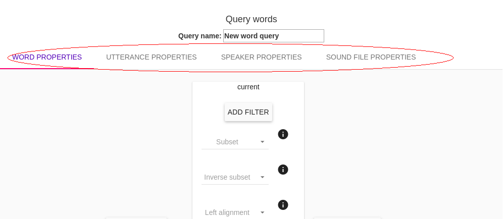
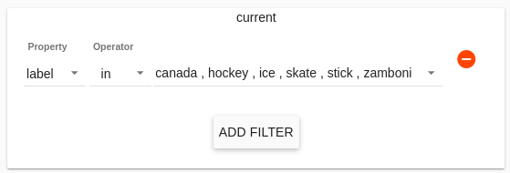
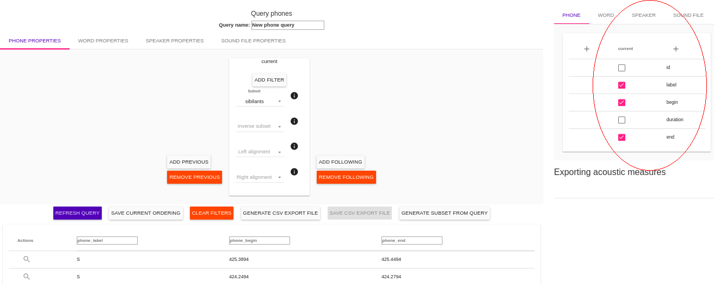

.. _query_iscan:

**********
Query View
**********

In this view, the user constructs queries by specifying a particular set of data of interest, and exports a CSV file of relevant linguistic information. For example uses of this page, please see the :ref:`tutorials_iscan`.

From the :ref:`summary_iscan`, the user selects a Linguistic Unit over which to query. A linguistic unit can be an utterance, word, syllable, or phone. By selecting a linguistic unit, the user is specifying the set of elements over which the query is to be made. For example, selecting “phones” will cause the program to look for phones with properties specified by the user (if “words” were selected, then the program would look for words, etc.) Go to :ref:`summary_iscan` for more information about linguistic units.

Building Queries
================

The user builds queries by specifying filters, subsets, and/or alignments for some linguistic unit. The user can specify particular properties for target units, as well as the units preceding and following the targets. Filters, alignments, and subsets may be specified on any linguistic type at or higher than the linguistic unit of interest. For example, if a user is querying words, filters may be specified over properties of words, over the properties of the utterances those words appear in, over the properties of the sound files in which the words appear, and over the speakers who produced the words. These can be added by selecting the linguistic type of interest in the top bar of the Query View.

Filters
*******

Filters are statements that limit the data returned to a specific set. Each filter added provides another constraint on the data. A filter can be specified by choosing the 'ADD FILTER' button. The filters a dropdown menu for *Property* and *Operator*, as well as a space to type in a *Value*.

Property
--------

.. TO DO: add properties available after enrichments (for all units)

The first dropdown menu when creating a filter is used to target a property.

**Phone Properties**

Without enrichment, the following properties are available for phones:

* *id* The identification key for the phone
* *label* The orthographic content of the phone
* *begin* The start time (seconds) of the phone
* *duration* The amound of time the phone occupies
* *end* The end time (seconds) of the phone

**Word Properties**

Without enrichment, the following properties are available for words:

* *id* The identification key for the word
* *label* The orthographic content of the word
* *transcription* The phonetic transctiption of the word in the corpus
* *begin* The start time (seconds) of the word
* *duration* The amound of time the word occupies
* *end* The end time (seconds) of the word

**Syllable Properties**

Without enrichment, no properties are available for syllables as they must first be encoded (see :ref:`tutorials_iscan` for directions to encode syllables). 

**Utterance Properties**

Without enrichment, no properties are available for utterances as they must first be encoded (see :ref:`tutorials_iscan` for directions to encode utterances). 

**Speaker Properties**

Without enrichment, the only property available for speakers is the speaker *name*. 

After enrichment, the properties available will depend on the metadata CSV file used as input for the enrichment. The speaker information files may include such demographic information as age, ethnicity, gender, place of birth, education level, native language, and so on, but the particular properties available will vary by corpus.

**Sound File Properties**

Without enrichment, the following properties are available for sound files:

* *duration* The amound of time of the whole sound file
* *name* The name of the sound file
* *sampling_rate* The number of times the audio is sampled per second
* *num_channels* The number of data channels contained in the file

Operator
--------

The second dropdown menu when creating a filter selects an operator.

* **==** means 'equals'. The property selected must match the value specified in the text box following this menu.
* **!=** means 'does not equal'. The property selected must *not* match the value specified in the text box following this menu.
* **in** (for lists of values) The property selected must appear in the specified subset of Values. For example, in a filter on *Speaker Properties*, over the property *name*, operator *in*, selecting a subset of the names in the *Value* dropdown menu will force the query only to output results for which the speaker name is one of those selected. 
* **not in** (for lists of values) The property selected must *not* appear in the specified subset of Values.
* **<** (for numeric values) The property selected must be less than the specified value. For example, with this operator you may specify that the *duration* of a *word* be less than 190 ms.
* **>** (for numeric values) The property selected must be greater than the specified value.
* **<=** (for numeric values) The property selected must be less than or equal to the specified value.
* **>=** (for numeric values) The property selected must be greater than or equal to the specified value.

Value
-----

The third field in building a filter is the Value. This may be a text box in which the user inputs a numeric value (for example representing miliseconds for durations, or time at the beginning/end) or a string value (for example representing the label of some phone, or the transcription of a word). In some cases this field may also be a list menu from which the user can select a subset (this will be the case when the operators *in* and *not in* are used). 

Subsets
*******

If the user has encoded subsets of linguistic units (for example, *sibilants* may be defined as a subset of phones), then these will be available to further limit the scope of queries to relevant segments. The user may specify one or more subsets that the linguistic unit must belong to. If multiple subsets are selected, the query will look for units that match *all* of them.

Additionally, inverse subsets can be defined, specifying one or more subsets that the linguistic unit must *not* belong to. If multiple subsets are selected, the query will look for units that do not match *any* of them.

Alignments
**********

The user may specify linguistic types that will be aligned at the left and right edges.

*Left alignment* specifies higher linguistic types that the left edges will be aligned. For example, left aligning words to utterances will get all utterance-initial words.

*Right alignment* Specifies higher linguistic types that the right edges will be aligned. For example, right aligning words to utterances will get all utterance-final words.

Exporting Queries
=================

Once all of the desired filters, subsets, and alignments have been selected to build the Query, several options are available at the bottom of this page. 

* **Run Query** This will generate the results of the query. The results will be displayed on the Query View page. The user can rename and reorder the displayed results by clicking on the column headers.

* **Refresh Query** At any time after running a query, the user may update/add/remove filters, subsets, and alignments. Refreshing the query will output the results of the query after the changes. This will also return the ordering of the columns of results to the default unless 'Save Current Ordering' has been selected.

* **Save Current Ordering** Clicking on the column headers in the displayed results will reorder them. These changes to the display are typically reverted to default when a query is refreshed. Selecting 'Save Current Ordering' saves the columns as they are displayed across refreshes.

* **Clear Filters** This button will clear all filters built by the user.

* **Generate CSV Export File** This will generate a CSV file in the format shown on the page as a result of running a query. This may take some time, depending on the size of the corpus.

* **Save CSV Export File** This allows you to download the generated CSV file and save it to your local machine.

* **Generate Subset from Query** Allows the user to name and identify results of the query to use in future queries. For example: the user may find all word initial phones in one query, then use *Generate Subset from Query* in order to easily query **'word-initial'** in future queries.

ISCAN shows the results of running a query on the page. This can be a quick way to visualize data, but most often the user will want to further manipulate the data (i.e. in R, MatLab, etc.) To this end, the user has the option to export query results. ISCAN allows the user to specify the information that is exported by adding columns to the final output file using the window which appears next to the search view.

The same properties appearing during query building will be available, and the user may tick the boxes next to the features to add them as columns to the output CSV.

