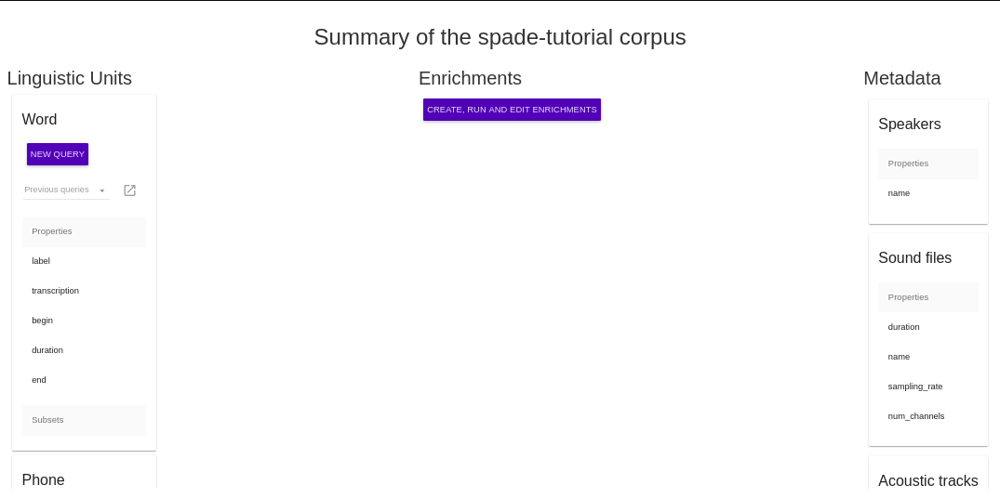

.. _summary_iscan:

***********
Corpus View
***********

The Corpus View is the first page a user sees after making a selection from the *Corpora* dropdown menu in the ISCAN banner (given that the corpus has been imported. See the :ref:`tutorials_iscan` for directions on importing.) This page provides an overview and summary of the selected corpus.

Linguistic Units
================

A linguistic unit can be an utterance, word, syllable, or phone.

#. **Utterance** An utterance is (loosely) a group of sounds delimited by relatively long pauses on either side. This could be a clause, sentence, or phrase. Note that utterances need to be encoded before they appear in the Corpus View. See :ref:`enrichment_iscan` for information on encoding utterances.
#. **Word** A word is a collection of phones that form a single meaningful element.
#. **Syllable** A syllable is a unit of pronunciation having one vowel sound. Syllables must be encoded before they appear in the Corpus View. See :ref:`enrichment_iscan` for information on encoding syllables.
#. **Phone** A phone is a single speech segment.

For each of the linguistic units, the Corpus View provides a summary of the encoded *properties* and *subsets*, and allows the user to begin a new query over that unit, or to view and continue editing previous queries.

Enrichments
===========

This section includes only a button to bring the user to the :ref:`enrichment_iscan`, where databases can be enriched by encoding various elements. Usually, the database starts off with just words and phones, but by adding enrichments a diverse range of information will become available to the user for searching with the :ref:`query_iscan`.

*note*: This button will be available only to users with permission to enrich. See :ref:`administration` if a user does not have the correct permissions.

Metadata
========

The right side bar of Corpus View summarizes any metadata available for the selected corpus.

#. **Speaker Properties** Specifies the metadata properties known about the speakers of a corpus. These are taken from a speaker information metadata file which can be uploaded in the :ref:`enrichment_iscan`. This might include the name, gender, ethnicity, education level, and age of each speaker, among many other properties.
#. **Sound File Properties** Specifies properties of the corpus sound files, such as the name, the duration, and the times that speech begins and ends for each file.
#. **Acoustic Tracks** Specifies which tracks, if any, have been encoded.
