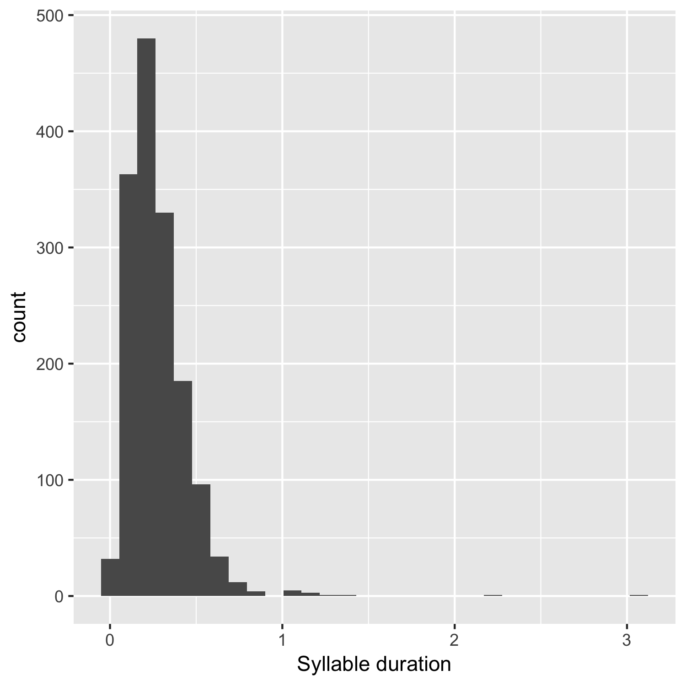
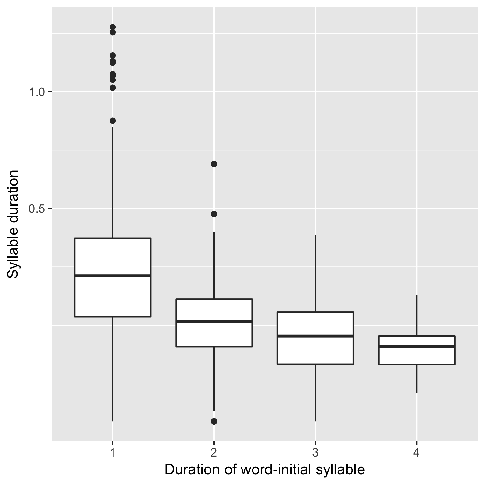
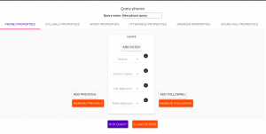
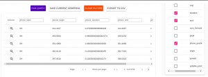

.. _`Montreal Forced Aligner`: https://github.com/MontrealCorpusTools/Montreal-Forced-Aligner
.. _`here`: http://spade.glasgow.ac.uk/wp-content/uploads/2018/07/speaker_info.csv
.. _`Lexicon CSV`: http://spade.glasgow.ac.uk/wp-content/uploads/2018/07/can_comparison.csv
.. _`Enriching`: https://polyglot-server.readthedocs.io/en/latest/enrichment_iscan.html
.. _`Enrichment`: https://polyglot-server.readthedocs.io/en/latest/enrichment_iscan.html
.. _`Enriching`: https://polyglot-server.readthedocs.io/en/latest/enrichment_iscan.html
.. _`Praat script`: https://raw.githubusercontent.com/MontrealCorpusTools/SPADE/master/Common/sibilant_jane_optimized.praat
.. _`FAVE`: https://github.com/JoFrhwld/FAVE/wiki/FAVE-align
.. _`ISCAN Prototypes`: http://spade.glasgow.ac.uk/wp-content/uploads/2018/08/ICECAN_prototypes.csv

.. _tutorials_iscan:

***************
ISCAN Tutorials
***************

The ISCAN system is a system for going from a raw speech corpus to a data file (CSV) ready for further analysis (e.g. in R), which conceptually consists of a pipeline of four steps:

1. **Importing the corpus into ISCAN**
	Result: a structured database of linguistic objects (words, phones, sound files).
2. **Enriching the database**
	Result: Further linguistic objects (utterances, syllables), and information about objects (e.g. speech rate, word frequencies).
3. **Querying the database**
	Result: A set of linguistic objects of interest (e.g. utterance-final word-initial syllables),
4. **Exporting the results**
	Result: A CSV file containing information about the set of objects of interest

Preliminaries
=============

Access
------

Before you can begin the tutorial, you will need access to log in to the ISCAN server via your web browser. To use ISCAN you need to get a username and password from whoever the administrator for the server is. For now, the only ISCAN server is at McGill, so the first step is to contact Vanna (On Slack in the #iscan-help channel or email to savanna.willerton@mail.mcgill.ca) to request access, who will provide you with a username and password.

To log in to the McGill ISCAN server via your web browser visit https://roquefort.linguistics.mcgill.ca, press the ‘Log in’ button on the top right of the screen and enter the username and password provided by Vanna.

Questions, Bugs, Suggestions
----------------------------

If at any point while using ISCAN you get stuck, have a question, encounter a bug (like a button which doesn’t work), or you see some way in which you believe the user interface could be improved to make usage more clear/smooth/straightforward/etc, then please see ISCAN – Getting Help and Giving Feedback (link TODO).

Tutorial 1: Polysyllabic shortening
===================================

Motivation
----------

Polysyllabic shortening refers to the "same" rhymic unit (syllable or vowel) becoming shorter as the size of the containing domain (word or prosodic domain) increases. Two classic examples:

* English: stick, sticky, stickiness (Lehiste, 1972)
* French: pâte, pâté, pâtisserie (Grammont, 1914)

Polysyllabic shortening is often – but not always – defined as being restricted to accented syllables. (As in the English, but not the French example.) Using ISCAN, we can check whether a simple version of polysyllabic shortening holds in the ICE-CAN corpus, namely:

* Considering all utterance-final words, does the initial vowel duration decrease as word length increases?

Step 1: Import
--------------

This tutorial will use the tutorial corpus available for you, available under the title 'spade-username'. The data for this corpus was parsed using the `Montreal Forced Aligner`_, with the result being one Praat TextGrid per sound file, aligned with word and phone boundaries. These files are stored on a remote server, and so do not require you to upload any audio or TextGrid files.

The first step of this analysis is to create a *Polyglot DB* object of the corpus which is suitable for analysis. This is performed in two steps:

+ *Importing* the dataset using ISCAN, using the phone, word, and speaker information contained in the corpus
+ *Enriching* the dataset to include additional information about (e.g., syllables, utterances), as well as properties about these objects (e.g., speech rate)

To import the corpus into ISCAN, select 'spade-username' corpus from the dropdown menu under the 'Corpora' tab in the navigation bar. Next, click the 'Import' button. This will import the corpus into ISCAN and return a structured database of objects: words, phones, and sound files), that will be interacted with in the following steps.

Step 2: Enrichment
------------------

Now that the corpus has been imported as a database, it is now necessary to *enrich* the database with information about linguistic objects, such as word frequency, speech rate, vowel duration, and so on. See the `Enrichment`_ page for more details

First, select the 'tutorial-username' under the 'Corpora' menu, which presents all of the current information available for this specific corpus. To start enrichment, click the 'create, edit, and run enrichments' button from this page. This page is referred to as the *Enrichment view*. At first, this page will contain an empty table - as enrichments are added, this table will be populated to include each of these enrichment objects. On the right hand side of the page are a list of new enrichments that can be created for this database.

Here, we will walk through each enrichment in turn necessary for examining vowel duration.

**Syllables**

Syllables are encoded in two steps. First, the set of syllabic segments in the phonological inventory have to be specified. To encode the syllablic segments:

1. Select 'Phone Subset' button under the 'Create New Enrichments' header
2. Select the 'Select Syllabics' preset option
3. Name the environment 'syllabics'
4. Select 'Save subset'

This will return you to the Enrichment view page. Here, press the 'Run' button listed under 'Actions'. Once syllabic segments have been encoded as such, you can encode the syllables themselves.

1. Under the ‘Annotation levels’ header, press the ‘Syllables’ button
2. Select *Max Onset* from the Algorithm dropdown menu
3. Select *syllabics* from the Phone Subset menu
4. Name the enrichment 'syllables'
5. Select 'Save enrichment'

Upon return to the Enrichment view, hit ‘Run’ on the new addition to the table.

**Speakers**

To enrich the database with speaker information:

1. Select the 'Properties from a CSV' option
2. Select 'Speaker CSV' from the 'Analysis' dropdown menu. Normally this file would be available from the SPADE Git repository; for this tutorial, however, the CSV is available `here`_. 
3. Upload the ICE-CAN 'speaker_info.csv' file from your local machine.
4. Select 'Save Enrichment' and then 'Run' from the Enrichment view.

**Lexicon**

As with the speaker information, lexical information can be uploaded in an analogous way. Using the `Lexicon CSV`_, select 'Lexicon CSV' from the dropdown menu, save the enrichment, and run it.

**Utterances**

For our purposes, we define an utterance as a stretch of speech separated by pauses. So now we will specify minimum duration of pause that separates utterances (150ms is typically a good default).

First, select 'pauses' from 'Annotation levels', and select '<SIL>' as the unit representing pauses. As before, select 'Save enrichment' and then 'run'.

With the positions of pauses encoded, we are now able to encode information about utterances:

1. Under the ‘Annotation levels’ header, select ‘utterances’.
2. Name the new addition ‘utterance’
3. Enter *150* in the box next to ‘Utterance gap(ms)’
4. Select ‘Save enrichment’, and then ‘Run’ in the Enrichment view.

**Speech rate**

To encode speech rate information, select 'Hierarchical property' from the Enrichment view. This mode allows you to encode rates, counts or positions, based on certain hierarchical properties (e.g., utterances, words). Here select the following attributes:

1. From the Higher annotation menu, select *utterance*
2. From the Lower annotation menu, select *syllable*
3. From the Property type menu, select *rate*

And then, as with previous enrichments, select 'Save enrichment' and then run.

**Stress**

Finally, to encode the stress position within each word:

* Select 'Stress from word property' from the Enrichment view menu. 
* From the 'wordproperty' dropdown box, select 'stresspattern'.
* Select 'Save enrichment' and run the enrichment in the Enrichment view.

Step 3: Query
---------------------

Now that the database has been enriched with all of the properties necessary for analysis, it is not necessary to construct a **query**. Queries enable us to search the database for particular set of linguistic objects of interest.

First, return to the Corpus Summary view by selecting 'tutorial-username' from the top navigation header. In this view, there is a series of property categories which you can navigate through to add filters to your search.

In this case, we want to make a query for:

* Word-initial syllables
* only in words at the end of utterances (fixed prosodic position)

Here, find the selection titled 'Syllables' and select 'New Query'. To make sure we select the correctly positioned syllables, apply the following filters:

Under **syllable** properties:

* Left aligned with: *word*
* Select 'add' filter, select 'stress' in the drop-down box, and enter '1' in the text box

Under **word** properties:

* Right aligned with: *utterance*

Provide a name for this query (e.g., 'syllable_duration') and select 'Save and run query'.

Step 4: Export
---------------------

This query has found all word-initial stressed syllables for words in utterance-final position. We now want to export information about these linguistic objects to a CSV file. We want it to contain everything we need to examine how vowel duration (in seconds) depends on word length. Here we may check all boxes which will be relevant to our later analysis to add these columns to our CSV file. The preview at the bottom of the page will be updated as we select new boxes:

1. Under the **SYLLABLE** label, select:
	* label
	* duration

2. Under the **WORD** label, select:
	* label
	* begin
	* end
	* num_syllables
	* stresspattern

3. Under the **UTTERANCE** label, select:
	* label

4. Under the **SPEAKER** label, select:
	* name

Once you have checked all relevant boxes, select 'Export to CSV'. Your results will be exported to a CSV file on your computer. The name will be the one you chose to save plus "export.csv". In our case, the resulting file will be called "syllable_duration export.csv".

Examining & analysing the data
------------------------------

In **R**, load the data as follows:

.. code-block:: R

	library(tidyverse)
	df <- read.csv('syllable_duration export.csv')

First, by checking how many words there are for each number of syllables in the CSV, we can see that only 1 word has 5 syllables:

.. code-block:: R
	group_by(df, word_num_syllables) %>% summarise(n_distinct(word_label))

	#   word_num_syllables `n_distinct(word_label)`
	#                <int>                    <int>
	# 1                  1                      236
	# 2                  2                      119
	# 3                  3                       35
	# 4                  4                        9
	# 5                  5                        1

And so the word with 5 syllables should be removed:

.. code-block:: R

	df <- filter(df, word_num_syllables < 5)

Similarly, it is worth checking the distribution of syllable durations to see if there are any extreme values:

.. code-block:: R

	ggplot(df, aes(x = syllable_duration)) + 
	geom_histogram() +
	xlab("Syllable duration")

As we can see here, there are a handful of extremely long syllables, which perhaps are the result of pragmatic lengthening or alignment error. To exclude these cases from analysis:

.. code-block:: R

	df <- filter(df, syllable_duration < 1.5)

Plot of the duration of the initial stressed syllable as a function of word duration (in syllables):

.. code-block:: R

	ggplot(df, aes(x = factor(word_num_syllables), y = syllable_duration)) +
	geom_boxplot() +
	xlab("Duration of word-initial syllable") + ylab("Syllable duration") +
	scale_y_sqrt()

Here it's possible to see some polysyllabic shortening effect between 1 and 2 syllables; this effect seems much smaller between 2+ syllables, though the effect continues in the expected (negative) direction.

Tutorial 2: Sibilants
=====================

Intro stuff here.

We will continue with the same corpus as in the Tutorial 1, so there is no need to import a new corpus. If you would like to test this analysis on a different corpus, please follow the import steps in Tutorial 1.

Step 1: Enrichment
------------------

It is not necessary to re-enrich the corpus with the elements from the previous tutorial, and so here will only include the enrichments necessary to analyse sibilants.

**Sibilants**

Start by looking at the options under 'Create New Enrichments', press the 'Phone Subset' button under the 'Subsets' header. Here we select and name subsets of phones. If we wish to search for sibilants, we have two options for this corpus:

* For our subset of ICE-Can we have the option to press the pre-set button 'Select sibilants'.
* For some datasets the 'Select sibilants' button will not be available. In this case you may manually select a subset of phones of interest.

Then choose a name for the subset (in this case 'sibilants' will be filled in automatically) and click 'Save subset'. This will return you to the Enrichment view where you will see the new enrichment in your table. In this view, press 'Run' under 'Actions'.

**Acoustics**

For this section, you will need a special praat script saved in the MontrealCorpusTools/SPADE GitHub repository which takes a few spectral measures (including COG and spectral slope) for a given segment of speech. With this script, ISCAN will take these measures for each sibilant in the corpus. A link is provided below, please save the <code>sibilant_jane_optimized.praat</code> file to your computer: `Praat script`_

From the Enrichment View, press the 'Custom Praat Script' button under the 'Acoustics' header. As usual, this will bring you to a new page. First, upload the saved file 'sibilant_jane_optimized.praat' from your computer using 'Choose Praat Script' button. Under the **Phone class** dropdown menu, select <i>sibilant</i>.

Finally, hit the 'Save enrichment' button, and 'Run' from the Enrichment View.

**Hierarchical Properties**

Next, from the **Enrichment View** press the 'Hierarchical property' button under 'Annotation properties' header. This will bring you to a page with four drop down menus (Higher linguistic type, Lower linguistic type, Subset of lower linguistic type, and Property type) where we can encode speech rates, number of syllables in a word, and phone position.

While adding each enrichment below, remember to choose an appropriate name for the enrichment, hit the 'save enrichment' button, and then click 'Run' in the Enrichment View.

*Syllable Count 1 (Number of Syllables in a Word)*

	* From the **Higher linguistic type** menu, select *word*
	* From the **Lower linguistic type** menu, select *syllable*
	* From the **Property type** menu, select *count*

*Syllable Count 2 (Number of Syllables in an Utterance)*

	* From the **Higher linguistic type** menu, select *utterance*
	* From the **Lower linguistic type** menu, select *syllable*
	* From the **Property type** menu, select *count*

*Phone Count (Number of Phones per Word)*

	* From the **Higher linguistic type** menu, select *word*
	* From the **Lower linguistic type** menu, select *phone*
	* From the **Property type** menu, select *count*

*Word Count (Number of Words in an Utterance)*

	* From the **Higher linguistic type** menu, select *utterance*
	* From the **Lower linguistic type** menu, select *word*
	* From the **Property type** menu, select *count*

*Phone Position*

	* From the **Higher linguistic type** menu, select *syllable*
	* From the **Lower linguistic type** menu, select *phone*
	* From the **Property type** menu, select *position*

Step 2: Query
-------------

The next step is to search the dataset to find a set of linguistic objects of interest. In our case, we're looking for all sibilants. Let's see how to do this using the **Query view**.

First, return to the the 'spade-yourUsername' Corpus Summary view, then navigate to the 'Phones' section and select **New Query**. This will take you to a new page, called the Query view, where we can put together and execute searches. In this view, there is a series of property categories which you can navigate through to add filters to your search. Under 'Phone Properties', there is a dropdown menu labelled **'Subset'**. Select 'sibilants'. You may select 'Add filter' if you would like to see more options to narrow down your search.

The selected filter settings will be saved for further use. It will automatically be saved as 'New phone query', but let's change that to something more memorable, say 'SibilantsTutorial'. When you are done, click the 'Run query' button. The search may take a while, especially for large datasets.

Step 3: Export
--------------

Now that we have made our query and extracted the set of objects of interest, we'll want to export this to a CSV file for later use and further analysis (i.e. in R, MatLab, etc.)

Once you hit 'Run query', your search results will appear below the search window. Since we selected to find all sibilants only, a long list of phone tokens (every time a sibilant occurs in the dataset) should now be visible. This list of sibilants may not be useful to our research without some further information, so let's select what information will be visible in the resulting CSV file using the window next to the search view.

Here we may check all boxes which will be relevant to our later analysis to add these columns to our CSV file. The preview at the bottom of the page will be updated as we select new boxes:

Under the **Phone** header, select:
	* label
	* begin
	* end
	* peak
	* slope
	* spread

Under the **Syllable** header, select:
	* stress

Under the **Word** header, select:
	* label

Under the **Utterance** header, select:
	* label

Under the **Speaker** header, select:
	* name

Under the **Sound File** header, select:
	* name

Once you have checked all relevant boxes, click the 'Export to CSV' button. Your results will be exported to a CSV file on your computer. The name will be the one you chose to save for the Query plus "export.csv". In our case, the resulting file will be called "SibilantsTutorial export.csv".

Step 4: Results
---------------

With the tutorial complete, we should now have a CSV file saved on our personal machine containing information about the set of objects we queried for and all other relevant information.

Tutorial 3: Vowel formants
==========================

This tutorial assumes you have completed the *import* and *enrichment* sections from the previous two tutorials, and so will only include the information specific to analysing formants.

Step 1: Enrichment
------------------

*Acoustics*

Now we will compute vowel formants for all stressed syllables using an algorithm similar to `FAVE`_.

For this last section, you will need a vowel prototype file. This one is also normally accessed after you've checked out the ICE-Can or tutorial corpus from the master SPADE Git repositories held on the McGill Roquefort server. Again, for the purposes of the tutorial, it is provided below. Please save the file to your computer.

`ISCAN Prototypes`_

From the Enrichment View, under the 'Acoustics' header, select 'Formant Points'. As usual, this will bring you to a new page. From the **Phone class** menu, select <em>stressed_vowels</em>. Using the 'Choose Vowel Prototypes CSV' button, upload the ICECAN_prototypes.csv file you saved. For **Number of iterations**, type 3 and for **Min Duration (ms)** type 50ms.

Finally, hit the 'Save enrichment' button. Then click 'Run' from the Enrichment View.

Step 2: Query
-------------

The next step is to search the dataset to find a set of linguistic objects of interest. In our case, we're looking for all stressed vowels, and we will get formants for each of these. Let's see how to do this using the **Query view**.

First, return to the the 'spade-yourUsername' Corpus Summary view, then navigate to the 'Phones' section and select **New Query**. This will take you to a new page, called the Query view, where we can put together and execute searches. In this view, there is a series of property categories which you can navigate through to add filters to your search. Under 'Phone Properties', there is a dropdown menu with search options labelled 'Subset'. Select 'stressed_vowels'. You may select 'Add filter' if you would like to see more options to narrow down your search.

The selected filter settings will be saved for further use. It will automatically be saved as 'New phone query', but let's change that to something more memorable, say 'ICE-Can Tutorial Formants'. When you are done, click the 'Save and run query' button. The search may take a while, especially for large datasets, but should not take more than a couple of minutes for this small subset of the ICE-Can corpus we're using for the tutorials.

Step 3: Export
--------------

Now that we have made our query and extracted the set of objects of interest, we'll want to export this to a CSV file for later use and further analysis (i.e. in R, MatLab, etc.)

Once you hit 'Save query', your search results will appear below the search window. Since we selected to find all stressed vowels only, a long list of phone tokens (every time a stressed vowel occurs in the dataset) should now be visible. This list of objects may not be useful to our research without some further information, so let's select what information will be visible in the resulting CSV file using the window next to the search view.

Here we may check all boxes which will be relevant to our later analysis to add these columns to our CSV file. The preview at the bottom of the page will be updated as we select new boxes:

Under the **Phone** header, select:
	* label
	* begin
	* end
	* F1
	* F2
	* F3
	* B1 (The bandwidth of Formant 1)
	* B2 (The bandwidth of Formant 2)
	* B3 (The bandwidth of Formant 3)
	* num_formants

Under the **Syllable** header, select:
	* stress
	* position_in_word

Under the **Word** header, select:
	* label
	* stresspattern

Under the **Utterance** header, select:
	* label

Under the **Speaker** header, select:
	* name

Under the **Sound File** header, select:
	* name

Once you have checked all relevant boxes, select 'Export to CSV'. Your results will be exported to a CSV file on your computer. The name will be the one you chose to save plus "export.csv". In our case, the resulting file will be called "ICE-Can Tutorial Formants export.csv".

Step 5: Results
---------------

With the tutorial complete, we should now have a CSV file saved on our personal machine containing information about the set of objects we queried for and all other relevant information.
